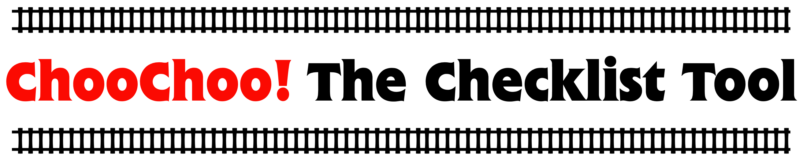

   
<!-- ALL-CONTRIBUTORS-BADGE:START - Do not remove or modify this section -->

<!-- ALL-CONTRIBUTORS-BADGE:END -->

ChooChoo is a **Ch**ecklist t**oo**l for educators. 

⚠️ ChooChoo is currently under development. It has a planned release date of September 2022. Documentation is on its way soon-ish 🐢.

✨ ChooChoo encourages learning through self-assessment, collaboration and diagnostic teaching. You can read more about the pedagogy underlying ChooChoo here (TODO: link).

✨ This repository contains the Python package that powers ChooChoo.

✨ If you would like to create your own ChooChoo project please head over to the [ChooChoo-template repository](https://github.com/lucydot/ChooChoo-template/). Alternatively, you can use or adapt an existing ChooChoo project (TODO: link).

✨ ChooChoo is free to use and adapt under a Creative Commons License. Pretty-please say hi :wave: if you are using ChooChoo - you can find my email address [here](https://lucydot.github.io/about/).

## Features

- 📋 Create checklists for your students to work through
- 🔗 Link checklist items to a question bank and/or tutorials
- ❓ Enable students contributions to the question bank
- ☑️ Student peer-review to decide which contributions are published
- 📊 Generate online plots to summarise class progress in real time 

## Contributors ✨

Thanks goes to these wonderful people ([emoji key](https://allcontributors.org/docs/en/emoji-key)):

<!-- ALL-CONTRIBUTORS-LIST:START - Do not remove or modify this section -->
<!-- prettier-ignore-start -->
<!-- markdownlint-disable -->
<table>
  <tr>
    <td align="center"><a href="http://lucydot.github.io"> <b>Lucy Whalley</b></a> <a href="https://github.com/lucydot/ChooChoo/commits?author=lucydot" title="Code">💻</a> <a href="https://github.com/lucydot/ChooChoo/commits?author=lucydot" title="Documentation">📖</a> <a href="https://github.com/lucydot/ChooChoo/commits?author=lucydot" title="Tests">⚠️</a> <a href="#ideas-lucydot" title="Ideas, Planning, & Feedback">🤔</a> <a href="#infra-lucydot" title="Infrastructure (Hosting, Build-Tools, etc)">🚇</a> <a href="#maintenance-lucydot" title="Maintenance">🚧</a> <a href="#projectManagement-lucydot" title="Project Management">📆</a></td>
  </tr>
</table>

<!-- markdownlint-restore -->
<!-- prettier-ignore-end -->

<!-- ALL-CONTRIBUTORS-LIST:END -->

This project follows the [all-contributors](https://github.com/all-contributors/all-contributors) specification. Contributions of any kind welcome!