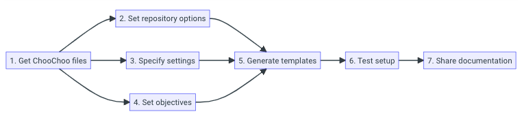

# Summary

ChooChoo is a **ch**ecklist t**oo**l for educators and students. 
ChooChoo encourages learning through student self-assessment, class collaboration and diagnostic teaching. 
Students and instructors interact with ChooChoo by writing comments in a Github issue thread. This makes ChooChoo especially relevant to those who already teach using Github. Although not its primary purpose, ChooChoo can also be used to introduce your students to Github and basic concepts in version control.
ChooChoo is free to use and adapt under a Creative Commons License.

# Statement of Need

Online repositories such as github are increasingly being used to open-source host educational content. 
This content is often designed to be used in both a formal education setting (e.g university), and more informally (e.g. at home with students working through at their own pace). 
In addition, students are often approaching the content with various levels of prior expertise; this is especially relevant for more computation-focused courses, where the level of programming experience can vary widely [@Dawson:2018, @Jordan:2018] 
In such cases, a certain amount of self-directed, independent learning is required. Self-assessment, where students can independently assess their current level of understanding, is a key aspect of this [@Brown:2014]. Checklists in particular can be used for students to monitor and track their progress through a couse [@Makram:2022].
However there are no checklist tools for education which can be easily integrated into a Github repository. The primary purpose of ChooChoo is to fill this gap.

# Target Audience 

ChooChoo is primarily aimed at people who already use Github for their teaching, and who would like to integrate a simple tool for student self-assessment. It can be integrated into an existing Github repository, or templated as a standalone project. As the instructor must write the checklist specific to their course (if not cloning an existing ChooChoo project), ChooChoo is a domain agnostic tool. 

ChooChoo is based around Github and, in particular, Github Issues. In addition, instructors use yaml to specify the ChooChoo checklists and settings. Self-assessment questions and tutorials (both optional features) are written using Markdown and/or Jupyter Notebooks. All three tools (Github, Markdown, yaml, Jupyter Notebooks) are widely used within the research computing community. Familiarity with these tools will make adopting ChooChoo for your own teaching more straight-forward. Importantly, ChooChoo does not require any local installations; everything is installed and ran remotely via Github.

# ChooChoo features 

#### Checklists and student self-assessment
- Automatically generate student checklists as a Github Issue
- Link checklist items to tutorials (external or deployed using ChooChoo)
- Link checklist items to questions stored in a question bank (built and deployed using ChooChoo)
- Generate personalised question sets for incomplete checklist items

#### Diagnostic teaching
- Generate and progress plots to visualise class progress in real time 

#### Class collaboration
- Students can propose new questions for the question bank
- Class votes to decide which questions are accepted into the bank

# Software design 

At the core of ChooChoo is a Python 3 package (https://github.com/lucydot/ChooChoo). This uses the matplotlib Python library for plotting [@Hunter:2007], PyGithub to interact with Github repositories, python-dotenv for reading environment variables and pyyaml for reading and writing yaml files.

Students and instructors interact with ChooChoo by writing ChooChoo commands in a Github issue thread. Github actions are used to process and act on each comment. This is done remotely on the Github servers. In particular, the actions: (i) parse the comment; (ii) install ChooChoo; (iii) run the ChooChoo command; (iv) update repository and/or issue thread accordingly; (v) update the associated gh-pages site with latest questions, tutorials and/or progress charts. The ChooChoo configuration files and Github action workflows necessary for this are available in the [ChooChoo-template repository](https://github.com/lucydot/ChooChoo-template). 

Automatic tests are ran in a [dedicated testing repository](https://github.com/choochoo-bot/ChooChoo-testing). This is a fork of the ChooChoo-template repo, and is updated daily with any changes made to the upstream repo. Once updated, a suite of tests are ran using Github actions. The [ChooChoo documentation](https://lucydot.github.io/ChooChoo/) is automatically built and deployed using mkdocs and Github actions.

# Integration into teaching

The first step is to setup a ChooChoo repository. The length of time this takes will depend on the number of checklist items, questions and tutorials you are setting, and familiarity with the tools used (Github, yaml, markdown). In many cases it will take one or less for a basic implementation; a diagram outlining the setup steps is given in Figure \autoref{fig:setup}.

Once setup is complete, students can generate their own personalised checklists by raising a Github Issue. In addition, students and instructors can use ChooChoo commands in the issue comments to monitor class progress, propose new self-assessment questions and generate personalised question sets. For more detailed information about setup and usage please see the [ChooChoo documentation](https://lucydot.github.io/ChooChoo/).

ChooChoo has been used to teach first and second year undergraduate students on the physics degree programme at Northumbria University (UK). It had particular success as a tool to help second year students re-cap basic computing skills learnt during their first year. An example checklist from this course can be found in [ChooChoo examples](https://github.com/lucydot/ChooChoo/examples/python_novice/).

Those who adopt ChooChoo for their own teaching are encouraged to share their checklists, question banks and tutorials for others to use and build on. Over time, we hope this will form a growing collection of ChooChoo repositories.

# Acknowledgements

LDW would like to thank Jeremy Cohen for discussions about the software design, and Ross Pallister and Prakriti Kayastha for assistance in trialling this tool with students.

# References
